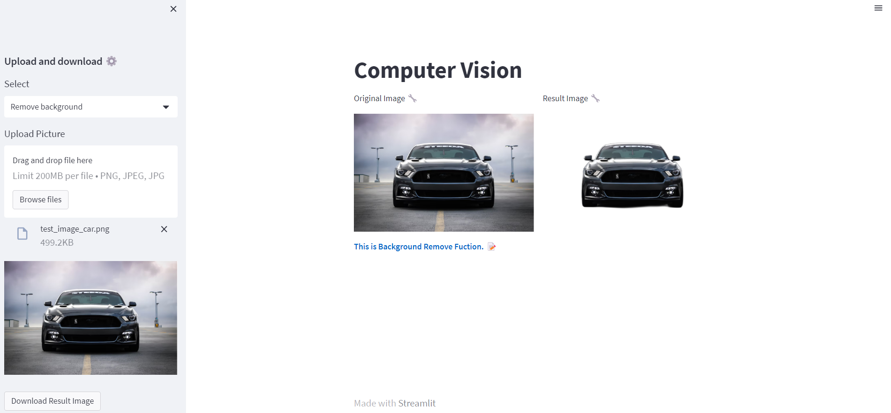

## Streamlit Custom Applications
In this project we have implemented web app using https://streamlit.io/, its a fast way to build GUI of any application. 


## Features

- Upload Image
- Upload Video
- Webcam Face Detection
- Background Removal


## Deployment

Use python 3.8.15 version. Create virtual environment using anaconda. Conda version (4.12.0).

Create Virtual Environment:

```bash
  conda create --name py38 python==3.8
  conda activate py38
  pip install -r requirements.txt
```

Requirements:

```bash
  pip install streamlit-webrtc
  pip install streamlit
  pip install opencv-python
  pip install numpy
  pip install rembg
  pip install -r requirements.txt
```

How to Run:

```bash
streamlit run app.py
```
OR

```bash
python streamlitWrapper.py
```

I have created subprocess method (streamlitWrapper) to direct run the streamlit program without using "streamlit run app.py". direct use python streamlitWrapper.py
## Result


